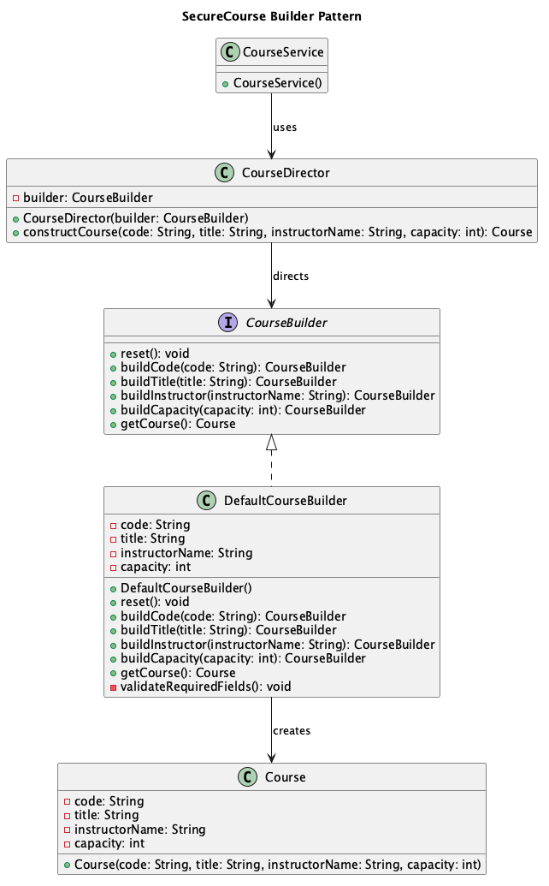
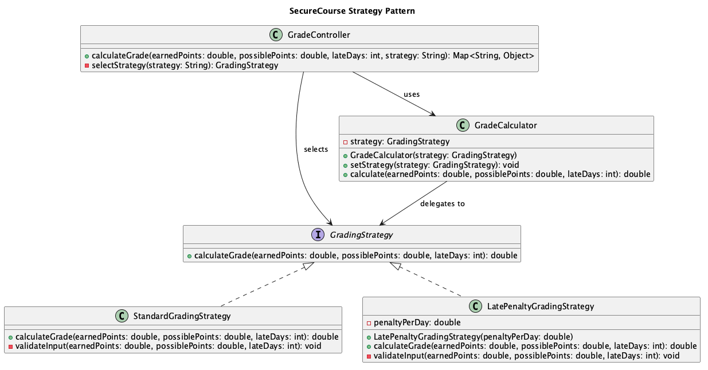

# SecureCourse

SecureCourse is my SE 450 Object Oriented Software Development project. The goal is to build a secure, role-based learning management system in Java. The project will focus on object-oriented design, modular code, testing, and custom implementations of design patterns.

## Sprint 1 Checklist

- **Are you in a Group?**  
  No, I am not in a group.

- **If so, who else is in your group?**  
  N/A

- **Do you have your GitHub account set up?**  
  Yes, I have my GitHub account set up.

- **Do you have a public repository for your Project?**  
  Yes, I have a public repository for my project.

- **What is the link to your GitHub repository?**  
  https://github.com/carlotarzua/SE450Project

- **If you are in a group, does everyone have write access to the GitHub repo?**  
  N/A

- **Do you have a “Hello World” program that compiles and runs?**  
  Yes. Sprint 1 started with a Hello World program. The project has now been expanded into a Spring Boot application for Sprint 2.

- **Where is the entry point to your project?**  
  `src/main/java/com/carlota/securecourse/SecureCourseApplication.java`

## Sprint 2 Project Proposal

### Project Name

**SecureCourse: Role-Based Learning Management System**

### Project Description

SecureCourse will be a learning management system with different user roles and permissions. The main roles will be Student, Instructor, and Admin. Each role will have access to different features in the application.

The goal is not to recreate a large system like Canvas. I plan to build a smaller working application that clearly demonstrates object-oriented design, security roles, modular classes, JUnit testing, and at least six custom design patterns.

### Planned Users and Features

#### Student

- View available courses
- Enroll in courses
- View assignments
- Submit assignments
- View grades

#### Instructor

- Create and manage courses
- Create assignments
- View enrolled students
- Grade submissions
- Publish course updates

#### Admin

- Manage users
- Assign roles
- View all courses
- Manage system-level settings

### Planned Technologies and Libraries

- Java 21
- Spring Boot
- Spring Security
- PostgreSQL
- Spring Data JPA
- JUnit
- Maven
- GitHub

For Sprint 2, the project includes a Spring Boot starter application, basic role-based security, starter course and user domain classes, and JUnit tests. PostgreSQL persistence and the larger feature set will be added in later sprints.

### Planned Design Patterns

The exact design may change as the application grows, but I currently plan to implement these patterns myself:

1. **Factory Pattern** - create different user types such as Student, Instructor, and Admin
2. **Strategy Pattern** - support different grading strategies
3. **Observer Pattern** - notify students when assignments or course updates are published
4. **State Pattern** - manage course states such as Draft, Open, In Progress, Completed, and Archived
5. **Command Pattern** - represent actions such as enrolling, dropping a course, submitting an assignment, and undoing supported actions
6. **Builder Pattern** - create Course objects with required and optional settings

These patterns will be implemented in my own project code. I will not count design patterns that are already built into Spring or other libraries.

### What I Plan to Demonstrate by the Final Submission

By the final submission, I plan to demonstrate a working application where:

- Users can authenticate
- Different roles have different permissions
- Students can view and enroll in courses
- Instructors can manage courses and assignments
- Admin users can manage users and roles
- Data is stored in PostgreSQL
- JUnit tests verify important behavior
- At least six different design patterns work as part of the application

### Current Sprint 2 Progress

- Converted the project from Hello World into a Spring Boot application
- Added a public application status endpoint
- Added role-based access rules with Spring Security
- Added Student, Instructor, and Admin demo accounts
- Added starter `UserAccount`, `Role`, and `Course` domain classes
- Added an in-memory `CourseService` with demo courses
- Added protected course and dashboard endpoints
- Added JUnit tests for course enrollment behavior

## Current Project Structure

```text
SE450Project/
├── pom.xml
├── README.md
├── src/
│   ├── main/
│   │   ├── java/com/carlota/securecourse/
│   │   │   ├── SecureCourseApplication.java
│   │   │   ├── config/
│   │   │   ├── controller/
│   │   │   ├── model/
│   │   │   └── service/
│   │   └── resources/
│   │       └── application.properties
│   └── test/
│       └── java/com/carlota/securecourse/
└── .gitignore
```

## Running the Project

Requirements:

- Java 21
- Maven

Run the application:

```bash
mvn spring-boot:run
```

Run tests:

```bash
mvn test
```

Then open:

```text
http://localhost:8080/
```

Public status endpoint:

```text
http://localhost:8080/api/status
```

### Demo Accounts

These accounts are only temporary Sprint 2 demo users. They will later be replaced with persistent users.

| Role | Username | Password |
|---|---|---|
| Student | `student` | `student123` |
| Instructor | `instructor` | `instructor123` |
| Admin | `admin` | `admin123` |

Protected endpoints:

```text
/api/student/dashboard
/api/student/courses
/api/instructor/dashboard
/api/instructor/courses
/api/admin/dashboard
```

## Sprint 3 Progress

### Implemented Design Patterns

For Sprint 3, I implemented two custom design patterns: the Builder pattern and the Strategy pattern. Both patterns were implemented in the SecureCourse source code rather than being provided by Spring or another external library.

### Builder Pattern

The Builder pattern is used to construct `Course` objects. It separates the construction process from the `Course` class and provides a consistent sequence for setting the course code, title, instructor, and capacity.

The relevant classes are:

- `CourseBuilder` — Builder interface that defines the course-construction steps.
- `DefaultCourseBuilder` — Concrete Builder that stores course information and creates a completed `Course`.
- `CourseDirector` — Director that controls the order in which the construction steps are completed.
- `Course` — Product created by the Builder.
- `CourseService` — Client that uses the Director and Builder to create courses for the application.

The pattern is integrated into the working application because `CourseService` uses it to construct the courses returned by the student and instructor course endpoints.



### Strategy Pattern

The Strategy pattern is used to support different methods of calculating assignment grades. The grading behavior can change without modifying the `GradeCalculator` context class.

The relevant classes are:

- `GradingStrategy` — Strategy interface that defines the grade-calculation operation.
- `StandardGradingStrategy` — Concrete Strategy that calculates a regular percentage.
- `LatePenaltyGradingStrategy` — Concrete Strategy that subtracts a configurable penalty for each late day.
- `GradeCalculator` — Context that delegates the calculation to the selected strategy.
- `GradeController` — Client that selects and uses a grading strategy through an instructor endpoint.

The instructor grading endpoint supports two strategies:

- `standard` — Calculates the regular percentage without a late penalty.
- `late` — Subtracts five percentage points for each late day.

The endpoint is:

```text
/api/instructor/grades/calculate
```

Example query:

```text
/api/instructor/grades/calculate?earnedPoints=90&possiblePoints=100&lateDays=2&strategy=late
```



### JUnit Testing

JUnit tests were added for both implemented design patterns.

The Builder tests verify that:

- `CourseDirector` constructs a course with the correct information.
- An incomplete course cannot be created.
- An invalid course capacity is rejected.
- The Builder is reset before another course is constructed.

The Strategy tests verify that:

- The standard percentage is calculated correctly.
- A late penalty is applied correctly.
- The grading strategy can be changed at runtime.
- A grade cannot become negative after penalties.
- Zero possible points are rejected.
- Negative late days are rejected.

The existing `CourseServiceTest` tests continue to verify course enrollment, duplicate-enrollment prevention, course lookup, and unknown-course handling.

### Final Submission Demonstration

For the final submission, I plan to demonstrate a working SecureCourse application in which users authenticate with different roles and access functionality based on their permissions.

Students will be able to view courses and enroll in them. Instructors will be able to view courses and calculate grades using different grading strategies. Admin users will have access to administrative functionality.

The final application will contain at least six custom design patterns. The Builder and Strategy patterns were completed during Sprint 3. Additional patterns will be implemented during the remaining development work.

### Problems Encountered

One challenge was ensuring that the design patterns were part of the actual SecureCourse functionality instead of being isolated demonstration classes. I addressed this by integrating the Builder pattern into `CourseService` and integrating the Strategy pattern into the instructor grade-calculation endpoint.

Another challenge was separating the responsibilities of the pattern participants. `CourseDirector` controls the construction process, while `DefaultCourseBuilder` stores the data needed to create the product. Similarly, `GradeCalculator` does not contain a fixed grading algorithm and instead delegates the calculation to a selected `GradingStrategy`.

The existing course creation code also had to be refactored so that courses were constructed through the Builder pattern while preserving the original enrollment behavior and passing the existing JUnit tests.
